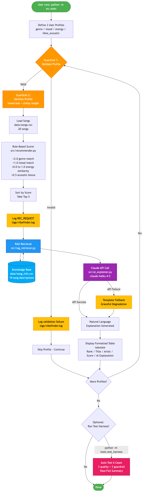

# VibeFinder 2.0 — AI-Powered Music Recommender

> An applied AI system that combines rule-based scoring with Claude-generated natural-language explanations, retrieval-augmented generation (RAG), input guardrails, persistent logging, and an automated test harness.

**Author:** Addree Barua  
**Course:** AI Engineering Program — Module 5 (Applied AI Systems)  
**Date:** April 2026  
**Repository:** https://github.com/AddreeBarua/applied-ai-system-final

---

## Base Project (Module 3 Origin)

This system extends my **Module 3 project, VibeFinder 1.0** (Music Recommender Simulation), into a full applied AI system.

The original VibeFinder 1.0 was a Python program that scored every song in a 20-song catalog against a user's taste profile (genre, mood, energy, acoustic preference) using a simple point-based scoring rule, then returned the top 5 matches with mechanical reason strings like `genre match (+2.0), mood match (+1.0)`. It worked, but it could not explain its choices in human language and had no safety, logging, or evaluation infrastructure.

---

## Title and Summary

**VibeFinder 2.0** turns a rule-based music recommender into an applied AI system. It still uses the original scoring logic to pick the top 5 songs, but now Claude (Anthropic's LLM) writes a friendly, personalized explanation for each pick. Before generating those explanations, the system retrieves song-specific descriptions from a custom knowledge base (RAG), so Claude grounds its output in real song details instead of guessing. The whole pipeline is wrapped in input guardrails, structured logging, and an automated test harness so the system is both safe and verifiable.

This matters because most AI projects in the real world are exactly this shape: a small model call surrounded by a lot of validation, retrieval, and reliability infrastructure. The point of this project was to learn that "applied AI" is mostly the plumbing, and to build that plumbing properly.

---

## Architecture Overview



The diagram above shows the full data flow through VibeFinder 2.0. A user runs `python -m src.main`, which defines three test profiles. Each profile passes through two guardrail checks (validation and sanitization) before reaching the rule-based scorer. The scorer loads the 20-song catalog, ranks the top 5, and logs the request. Each top result then triggers a RAG retrieval against `data/song_info.csv` — the lookup result is injected into the Claude prompt, and Claude generates a natural-language explanation. If the API fails, a template fallback runs instead, so the system never crashes. Final results are displayed in a formatted table. An optional test harness (`python -m tests.test_harness`) runs the same pipeline through 6 predefined cases (3 valid, 3 invalid) and prints a Pass/Fail summary.

The colors in the diagram correspond to component categories: green = entry/exit, orange = guardrails, blue = RAG, purple = LLM, yellow = logging or fallback, pink = test harness.

---

## Setup Instructions

### Prerequisites

- Python 3.10 or higher
- An Anthropic API key — sign up at [console.anthropic.com](https://console.anthropic.com) 

### Step 1 — Clone the Repository

```bash
git clone https://github.com/AddreeBarua/applied-ai-system-final.git
cd applied-ai-system-final
```

### Step 2 — Install Dependencies

```bash
pip install -r requirements.txt
```

This installs `anthropic`, `python-dotenv`, `tabulate`, and `pytest`.

### Step 3 — Add Your Claude API Key

Create a `.env` file in the project root and add your key:

```bash
touch .env
echo "ANTHROPIC_API_KEY=sk-ant-api03-your-key-here" > .env
```

The `.env` file is listed in `.gitignore`, so it will never be committed.

### Step 4 — Run the System

```bash
python -m src.main
```

You should see three formatted tables, one per user profile, each with five AI-generated recommendations.

### Step 5 — Run the Test Harness

```bash
python -m tests.test_harness
```

This runs all 6 automated tests and prints a Pass/Fail summary.

### Step 6 — Inspect the Logs

```bash
cat logs/vibefinder.log
```

Every recommendation request and every validation failure is logged here with a timestamp.

---

## Sample Interactions

The system was tested with three distinct user profiles. Below are the actual top-ranked outputs from a real run.

### Sample 1 — Happy Pop Fan

**Input:**
```python
{"genre": "pop", "mood": "happy", "energy": 0.8, "likes_acoustic": False}
```

**Output (top recommendation):**
Rank 1: Sunrise City by Neon Echo  (score: 3.98)
AI explanation: "Sunrise City by Neon Echo is perfect for you — it has those
bright synth-pop melodies and feel-good energy that match your happy vibe!"

### Sample 2 — Chill Lofi Listener

**Input:**
```python
{"genre": "lofi", "mood": "chill", "energy": 0.2, "likes_acoustic": True}
```

**Output (top recommendation):**
Rank 1: Library Rain by Paper Lanterns  (score: 4.35)
AI explanation: "Library Rain by Paper Lanterns pairs gentle rain sounds with
mellow keys — perfect for that cozy, focused chill vibe you love!"

### Sample 3 — Guardrail Catches Invalid Input

**Input:**
```python
{"genre": "jazz_fusion_dubstep", "mood": "happy", "energy": 999, "likes_acoustic": False}
```

**Output:**
[GUARDRAIL] Skipping profile: Genre 'jazz_fusion_dubstep' is not in our catalog.
[Logged to logs/vibefinder.log as VALIDATION_FAILED]

The system continues processing other profiles instead of crashing.

---

## Design Decisions

**Why RAG instead of just the LLM?**  
Without RAG, Claude only sees structured fields (genre, mood, energy numbers) and has to invent specifics about each song. With RAG, Claude sees real descriptions ("driving guitar riffs", "synth-pop melodies", "warm acoustic instrumentation") pulled from `data/song_info.csv`. This dramatically improves explanation accuracy — Claude no longer has to make up sonic details. It also lets me update song knowledge without retraining anything.

**Why a fallback template?**  
Production AI systems should degrade gracefully. If the Claude API is down, rate-limited, or the user's API key expires, VibeFinder still produces a useful (if less rich) explanation rather than crashing. This is implemented in `_fallback_explanation()` and tested as part of the harness.

**Why custom guardrails instead of letting Claude handle bad input?**  
Guardrails fail fast and cheaply. Validating a profile takes microseconds and zero API calls; sending malformed input to Claude wastes tokens and produces unpredictable behavior. The guardrail layer also produces structured error messages that can be logged and analyzed.

**Why an independent test harness alongside pytest?**  
Pytest is great for unit tests of pure functions. The test harness (`tests/test_harness.py`) tests the full system end-to-end with the real API, including AI explanation quality (does the response mention the song name? Is it non-empty?). That kind of integration check is hard to express cleanly in pytest.

**Trade-off: API cost vs. UX.**  
Each recommendation call costs ~$0.001 in API tokens, which is fine for a classroom project but would need caching and batching at scale. For now, the system makes one Claude call per top-5 result (15 calls per full run), which is acceptable for demo purposes.

---

## Testing Summary

The automated test harness in `tests/test_harness.py` runs 6 tests covering 21 individual checks.

**Latest run: 6 / 6 tests passed.**

| Section | Tests | What It Checks |
|---|---|---|
| Recommendation Quality | 3 | For each profile: 5 results returned, top genre matches expectation, top score above threshold, AI explanation non-empty, explanation references song or artist by name. |
| Guardrails | 3 | Verifies that bad profiles (unknown genre, energy out of range, missing keys) are correctly rejected by the validation layer. |

**What worked well:**  
All three valid profiles produced correctly-ranked results with grounded, on-topic AI explanations that mentioned the song name in every case. The guardrails correctly rejected all three bad-input cases with clear error messages logged to `logs/vibefinder.log`.

**What didn't work initially:**  
On the first run of `python -m src.main`, I got `ModuleNotFoundError: No module named 'recommender'` because my imports were relative. I fixed this by changing them to `from src.recommender import ...`. I also noticed that one Claude response in Profile 3 included an emoji (🔥) even though my prompt did not request one — a reminder that LLM output is non-deterministic and prompts cannot fully control style.

**What I learned:**  
End-to-end tests with the real API caught issues that unit tests would have missed (like the import path bug and prompt-format issues). Logs proved invaluable when debugging — having a timestamped record of every request and every validation failure made root-cause analysis fast.

---

## Reflection (Required Reflection Prompts)

### What are the limitations or biases in your system?

The catalog is tiny (20 songs), so the system can never recommend something genuinely novel — it only re-ranks what's there. The scoring rule weights genre at +2.0 (the highest weight), which means a genre-matched mediocre song will always beat a non-matched great song. The hand-written knowledge base in `data/song_info.csv` reflects my own descriptive choices and English-language framing; it doesn't represent how speakers of other languages, or fans from other regions, would describe these tracks. Claude's training data also has its own cultural and stylistic biases that get inherited into our explanations.

### Could your AI be misused, and how would you prevent that?

The biggest misuse risk is using LLM-written explanations to falsely market songs the user wouldn't actually like — for example, a streaming service generating glowing AI explanations to push songs that pay for placement. To prevent this, I would (1) clearly disclose that explanations are AI-generated, (2) require explanations to be grounded in retrieved facts (which RAG already encourages), (3) log every explanation for after-the-fact auditing, and (4) never let the LLM override the rule-based scoring — Claude only writes the explanation, never decides the rank.

### What surprised you while testing your AI's reliability?

Two surprises stood out. First, how much **prompt wording** changed output quality — adding "vary your openings" and "mention the song name" made Claude's explanations measurably more varied and useful. Second, how much **the fallback layer earned its place**. During development I deliberately left the API key blank to test the template fallback, and the system kept working with no errors. That confidence in graceful degradation is something I now value far more than I did before this project.

### Describe your collaboration with AI during this project. Give one helpful and one flawed suggestion.

I used Claude extensively as a coding partner throughout this project — both for code generation and for design questions.

**Helpful suggestion:** When I was building `src/guardrails.py`, Claude suggested I use `dict.get(key, default)` instead of direct `dict[key]` access when reading profile fields. I adopted this immediately because it prevents `KeyError` if a field is missing and makes the validation layer more defensive. This pattern shows up throughout the file now.

**Flawed suggestion:** Claude initially suggested using `pip freeze > requirements.txt` to capture my dependencies. I ran the command and it dumped 200+ packages from my entire conda environment into the file — completely unusable for someone trying to install just my project's dependencies. I rejected this and manually wrote a clean four-line `requirements.txt` listing only `pytest`, `tabulate`, `anthropic`, and `python-dotenv`. The lesson: convenient AI suggestions can be technically correct but contextually wrong, and you have to know enough to recognize that.

---

## Demo Video

A walkthrough of the system running end-to-end is available on Loom:

**[Loom video link will be added after recording]**

The video demonstrates:
- End-to-end system run with 3 user profiles
- RAG behavior (Claude using retrieved song descriptions)
- Guardrail behavior (catching invalid input)
- Test harness running and printing the 6/6 pass summary

---

## Repository Structure
applied-ai-system-final/
├── assets/
│   └── architecture.png          # System architecture diagram
├── data/
│   ├── songs.csv                 # 20-song catalog with audio features
│   └── song_info.csv             # RAG knowledge base (1 description per song)
├── logs/
│   └── vibefinder.log            # Persistent recommendation logs
├── src/
│   ├── ai_explainer.py           # Claude API integration with RAG and fallback
│   ├── guardrails.py             # Input validation, sanitization, logging
│   ├── main.py                   # CLI entry point
│   ├── rag_retriever.py          # Knowledge base lookup
│   ├── recommender.py            # Rule-based scorer
│   ├── scoring_system.py         # Reference scoring functions
│   └── user_profiles.py          # Profile constants
├── tests/
│   ├── test_recommender.py       # Pytest unit tests
│   └── test_harness.py           # Automated end-to-end evaluation harness
├── .env                          # API key (gitignored)
├── .gitignore
├── README.md                     # This file
├── model_card.md                 # Reflections, limitations, ethics
└── requirements.txt

---

## Portfolio Reflection

This project says I am an AI engineer who values reliability over novelty. I did not build the most elaborate system possible in the time I had — I built one that handles bad input cleanly, explains its decisions in human language, falls back gracefully when the API is unavailable, and proves it works through automated tests. Those traits are what I would bring to any AI engineering role.